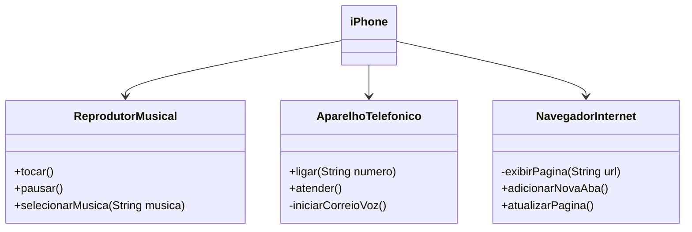

# dio-desafio-uml
Criar um diagrama de classes com Mermaid

## Autores
- [Jhoão Pedro](https://github.com/jhopn)
  

```mermaid
classDiagram
    class ReprodutorMusical {
        +tocar()
        +pausar() 
        +selecionarMusica(String musica)
    }

    class AparelhoTelefonico {
        +ligar(String numero)
        +atender()
        -iniciarCorreioVoz()
    }

    class NavegadorInternet {
        -exibirPagina(String url)
        +adicionarNovaAba()
        +atualizarPagina()
    }

    class iPhone {
    }

    iPhone --> ReprodutorMusical
    iPhone --> AparelhoTelefonico
    iPhone --> NavegadorInternet
```
